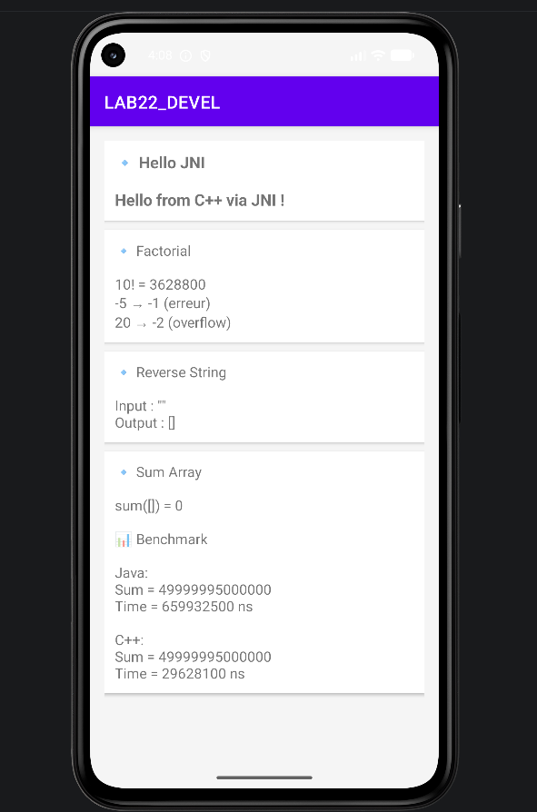

# 📱 LAB 22 — JNI (Java Native Interface)

## 🎯 Objectif

Ce laboratoire a pour objectif d’apprendre à intégrer du code natif **C++** dans une application Android en utilisant **JNI (Java Native Interface)**.

---

## 🧠 Concepts abordés

* JNI (communication Java ↔ C++)
* NDK (Native Development Kit)
* CMake (compilation du code natif)
* Manipulation de données entre Java et C++
* Gestion des erreurs (overflow, valeurs invalides)

---

## ⚙️ Fonctionnalités de l’application

L’application réalise plusieurs opérations en utilisant du code C++ :

### 🔹 Hello JNI

Affichage d’un message provenant du code natif.

### 🔹 Factorial

Calcul du factoriel avec gestion d’erreurs :

* valeur négative → `-1`
* dépassement (overflow) → `-2`

### 🔹 Reverse String

Inversion d’une chaîne de caractères via C++.

### 🔹 Sum Array

Somme d’un tableau d’entiers.

### 🔹 Benchmark Java vs C++

Comparaison des performances entre Java et C++.

---

## 🔄 Architecture

Java appelle des méthodes natives :

```
Java → JNI → C++ → Résultat → Java
```

---

## 📊 Résultat de l’application

Voici le rendu de l’interface :



---

## 🧪 Résultats obtenus

* ✔ Communication JNI fonctionnelle
* ✔ Résultats corrects pour toutes les fonctions
* ✔ Benchmark montrant les différences de performance

---

## 🚀 Technologies utilisées

* Java (Android)
* C++
* JNI
* Android NDK
* CMake

---

## 🎓 Conclusion

Ce laboratoire permet de comprendre comment intégrer du code natif dans une application Android, et montre l’intérêt du C++ en termes de performance et de sécurité.

---

## 👩‍💻 Réalisé par

Fatimaezzahra Ennassiri
